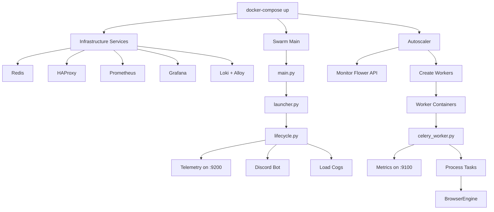

# Swarm Service Architecture

This document maps all services in the Swarm system, where they are defined, and how they are started.

## Service Categories

### 1. Core Discord Bot Services

These are started when the main Swarm application launches.

| Service | Location | Started By | Purpose |
|---------|----------|------------|---------|
| **Discord Bot** | `swarm/core/discord/boot.py` | `main.py` → `launcher.py` → `lifecycle.py` | Main Discord interface |
| **Telemetry Exporter** | `swarm/core/telemetry.py` | `lifecycle.py:67` | Prometheus metrics on port 9200 |
| **Discord Cogs** | `swarm/plugins/commands/` | `lifecycle.py:133-178` | Discord slash commands |

### 2. Distributed Worker Services

| Service | Location | Started By | Purpose |
|---------|----------|------------|---------|
| **Celery Worker** | `swarm/celery_worker.py` | `entrypoint.worker.sh` | Processes browser/LLM tasks |
| **Worker Metrics** | `swarm/celery_worker.py:156` | Each worker on startup | Prometheus metrics on port 9100 |
| **Browser Engine** | `swarm/browser/engine.py` | Within Celery tasks | Playwright browser automation |

### 3. Infrastructure Services (docker-compose.yml)

| Service | Container | Ports | Purpose |
|---------|-----------|-------|---------|
| **Redis** | `redis:7-alpine` | 6379 | Message broker & state storage |
| **HAProxy-Redis** | Custom image | 6380, 8080 | Redis failover proxy |
| **Prometheus** | `prom/prometheus` | 9090 | Metrics storage |
| **Grafana** | `grafana/grafana` | 3000 | Metrics visualization |
| **Loki** | `grafana/loki` | 3100 | Log aggregation |
| **Alloy** | `grafana/alloy` | 12345 | Log collection from Docker |
| **Flower** | `mher/flower:2.0` | 5555 | Celery task monitoring |
| **Celery-Exporter** | `danihodovic/celery-exporter` | 9808 | Celery metrics for Prometheus |
| **Autoscaler** | Custom image | - | Scales workers based on queue depth |

### 4. Orphaned/Unused Services

| Service | Location | Status | Reason |
|---------|----------|--------|--------|
| **ScalingService** | `swarm/distributed/services/scaling_service.py` | ❌ Orphaned | Replaced by celery_autoscaler.py |
| **QueueMetricsService** | `swarm/distributed/services/queue_metrics.py` | ❌ Unused | Designed for Redis streams, not Celery |
| **TankpitEngine** | `swarm/infra/tankpit/engine.py` | ❌ Unused | Proxy service not yet implemented |

## Service Startup Flow



## Service Discovery & Registration

### Current State
- Services are mostly hardcoded in their startup locations
- No central service registry
- Docker Compose manages infrastructure services
- Autoscaler dynamically creates worker containers

### Dependency Injection (DI) Container
Located in `swarm/core/containers.py`:

```python
# Registered but unused:
- scaling_service (ScalingService)
- redis_client (used by some services)
- distributed_config
- scaling_backend

# Active registrations:
- config (Settings)
- history_backend
- llm_providers
- metrics_helper
- All Discord cogs
- remote_browser (CeleryBrowserRuntime)
```

## Service Communication

### Message Patterns
1. **Redis Pub/Sub**: Not currently used
2. **Celery Tasks**: Primary async communication
3. **HTTP APIs**: Metrics endpoints, Flower API
4. **Discord Events**: User interactions

### Data Stores
1. **Redis**: 
   - Celery broker (queues)
   - Session state (`browser:session:*`)
   - Worker heartbeats (old system)

2. **Prometheus**: Time-series metrics
3. **Loki**: Log aggregation

## Monitoring & Health Checks

### Health Check Endpoints
- Swarm main: `http://localhost:9200/metrics`
- Workers: `http://localhost:9100/metrics`
- Flower: `http://localhost:5555/healthcheck`
- Celery-Exporter: `http://localhost:9808/health`
- Prometheus: `http://localhost:9090/-/ready`
- Loki: `http://localhost:3100/ready`
- Grafana: `http://localhost:3000/api/health`

### Docker Health Checks
All services have health checks defined in docker-compose.yml using either:
- HTTP endpoint checks
- Process existence checks
- Command execution checks

## Recommendations

### 1. Clean Up Orphaned Services
- Remove ScalingService from containers.py
- Remove QueueMetricsService (not compatible with Celery)
- Remove or refactor TankpitEngine for current needs

### 2. Service Organization
Create clear separation:
```
swarm/
├── services/          # Active service implementations
│   ├── discord/       # Discord-specific services
│   ├── worker/        # Worker-related services
│   └── monitoring/    # Metrics, health checks
├── tasks/             # Celery task definitions
└── infrastructure/    # Docker, K8s configurations
```

### 3. Service Registry Pattern
Consider implementing a service registry for the future:
```python
# swarm/services/registry.py
class ServiceRegistry:
    def register(self, name: str, service: Any) -> None:
        """Register a service for discovery."""
        
    def get(self, name: str) -> Any:
        """Get a registered service."""
        
    def health_check(self) -> Dict[str, bool]:
        """Check health of all registered services."""
```

### 4. Startup Optimization
- Lazy load services that aren't immediately needed
- Implement proper shutdown handlers for all services
- Add startup dependency checking

## Next Steps

1. **Phase 1**: Document and clean up orphaned services
2. **Phase 2**: Reorganize service directories
3. **Phase 3**: Implement service registry pattern
4. **Phase 4**: Add service mesh for complex routing (K8s phase)